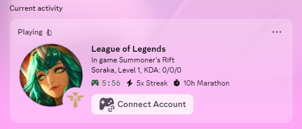

# League RPC
A Windows tray app made to improve Discord Rich Presence for League of Legends. The app shows your champion, role, level, and KDA.

## Features

- Shows champion, KDA, and game time shown on your Discord profile
- Displays role (Top, Jungle, Mid, Bot, Support)
- Map detection (Summoner's Rift, ARAM, Arena, etc.) TODO TFT
- Icons for current skin
- Runs in the system tray
- One-click Windows installer available

## Screenshots

<p>
  
</p>

## Installation

### Option 1: Installer (recommended)

1. Download the latest `LeagueRPC-Setup.exe` from the [Releases](https://github.com/EatPancake/LeagueRPC/releases) page
2. Run the installer and follow the prompts
3. Launch League RPC from the Start Menu (or let it launch automatically after install)
4. Make sure Discord is running, then start a League game

### Option 2: Portable

1. Download the latest `LeagueRPC.exe` from [Releases](https://github.com/EatPancake/LeagueRPC/releases)
2. Run it directly, no installation needed

## How It Works

League RPC polls Riot's [Live Client Data API](https://developer.riotgames.com/docs/lol#game-client-api), which is exposed locally by the League client only while a game is active. Then displays it using [DiscordRichPresence](https://github.com/Lachee/discord-rpc-csharp).

## Requirements

- Windows 10/11
- [Discord desktop app](https://discord.com/download)
- League of Legends

## Building From Source

```bash
git clone https://github.com/EatPancake/LeagueRPC.git
cd LeagueRPC
dotnet publish -c Release -r win-x64 --self-contained true -p:PublishSingleFile=true -p:IncludeNativeLibrariesForSelfExtract=true
```

The published exe will be in `bin/Release/net10.0-windows/win-x64/publish/`.

To build the installer, install [Inno Setup](https://jrsoftware.org/isdl.php) and compile `installer.iss`.

## Disclaimer

League RPC isn't endorsed by Riot Games. League of Legends and Riot Games are trademarks of Riot Games, Inc. Champion assets sourced from [CommunityDragon](https://www.communitydragon.org/).

## License

MIT